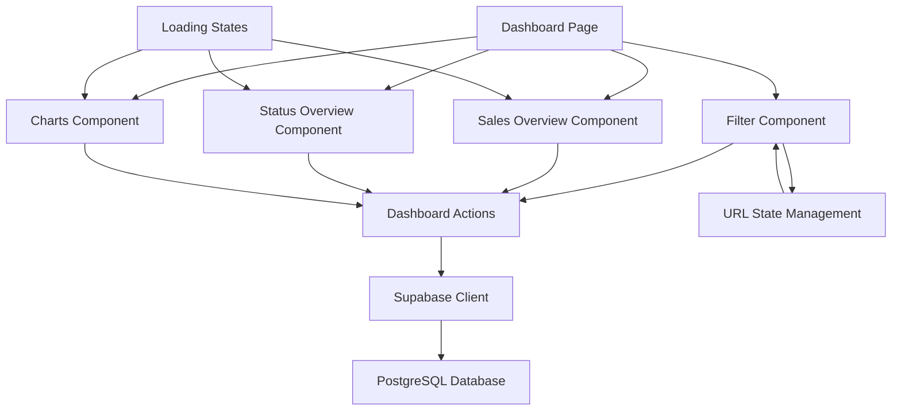

# Design Document

## Overview

The dynamic dashboard analytics feature transforms the static dashboard into a comprehensive, real-time business intelligence system. The solution leverages the existing database schema to provide actionable insights through interactive charts, filterable metrics, and responsive design patterns. The architecture follows Next.js 14 server actions pattern with optimized database queries and client-side state management for filtering.

## Architecture

### High-Level Architecture



### Component Architecture

1. **Dashboard Page (`/app/(dashboard)/page.tsx`)**

   - Main container component
   - Handles authentication and authorization
   - Manages global loading states
   - Coordinates filter state across components

2. **Filter Component (`/components/dashboard/DateRangeFilter.tsx`)**

   - Provides date range selection UI
   - Manages URL query parameters
   - Triggers data refresh on filter changes

3. **Analytics Components**

   - `SalesOverview`: Displays sales metrics cards
   - `StatusOverview`: Shows order status counts
   - `DashboardCharts`: Contains WeeklySales and BestSellers charts

4. **Server Actions (`/actions/dashboard-actions.ts`)**
   - Handles all database queries
   - Implements business logic for calculations
   - Provides type-safe data fetching

## Components and Interfaces

### Data Types

```typescript
// Dashboard filter types
export interface DateFilter {
  type:
    | "today"
    | "yesterday"
    | "this_week"
    | "last_week"
    | "this_month"
    | "last_month"
    | "custom";
  startDate?: Date;
  endDate?: Date;
}

// Sales metrics
export interface SalesMetrics {
  todayOrders: number;
  yesterdayOrders: number;
  thisMonth: number;
  lastMonth: number;
  allTime: number;
}

// Order status metrics
export interface OrderStatusMetrics {
  total: number;
  pending: number;
  processing: number;
  delivered: number;
}

// Chart data types
export interface WeeklySalesData {
  labels: string[];
  salesData: number[];
  ordersData: number[];
}

export interface BestSellersData {
  labels: string[];
  data: number[];
  colors: string[];
}

// Additional analytics
export interface AdditionalMetrics {
  averageOrderValue: number;
  peakHours: { hour: number; count: number }[];
  uniqueCustomers: number;
  popularDiningOption: "indoor" | "delivery";
}
```

### Server Actions Interface

```typescript
// Dashboard actions
export async function getDashboardMetrics(filter: DateFilter): Promise<{
  sales: SalesMetrics;
  orders: OrderStatusMetrics;
  charts: {
    weeklySales: WeeklySalesData;
    bestSellers: BestSellersData;
  };
  additional: AdditionalMetrics;
}>;

export async function getSalesMetrics(
  filter: DateFilter
): Promise<SalesMetrics>;
export async function getOrderStatusMetrics(
  filter: DateFilter
): Promise<OrderStatusMetrics>;
export async function getWeeklySalesData(
  filter: DateFilter
): Promise<WeeklySalesData>;
export async function getBestSellersData(
  filter: DateFilter
): Promise<BestSellersData>;
export async function getAdditionalMetrics(
  filter: DateFilter
): Promise<AdditionalMetrics>;
```

### Component Props

```typescript
// Filter component props
interface DateRangeFilterProps {
  onFilterChange: (filter: DateFilter) => void;
  currentFilter: DateFilter;
  isLoading?: boolean;
}

// Analytics component props
interface SalesOverviewProps {
  data: SalesMetrics;
  isLoading: boolean;
  error?: string;
}

interface StatusOverviewProps {
  data: OrderStatusMetrics;
  isLoading: boolean;
  error?: string;
}

interface DashboardChartsProps {
  weeklySalesData: WeeklySalesData;
  bestSellersData: BestSellersData;
  isLoading: boolean;
  error?: string;
}
```

## Data Models

### Database Query Patterns

#### Sales Metrics Queries

```sql
-- Today's orders
SELECT COALESCE(SUM(total_amount), 0) as total_sales
FROM orders
WHERE business_id = $1
  AND DATE(created_at) = CURRENT_DATE
  AND status IN ('delivered', 'completed');

-- Yesterday's orders
SELECT COALESCE(SUM(total_amount), 0) as total_sales
FROM orders
WHERE business_id = $1
  AND DATE(created_at) = CURRENT_DATE - INTERVAL '1 day'
  AND status IN ('delivered', 'completed');

-- This month's orders
SELECT COALESCE(SUM(total_amount), 0) as total_sales
FROM orders
WHERE business_id = $1
  AND DATE_TRUNC('month', created_at) = DATE_TRUNC('month', CURRENT_DATE)
  AND status IN ('delivered', 'completed');

-- Custom date range
SELECT COALESCE(SUM(total_amount), 0) as total_sales
FROM orders
WHERE business_id = $1
  AND DATE(created_at) BETWEEN $2 AND $3
  AND status IN ('delivered', 'completed');
```

#### Order Status Queries

```sql
-- Order counts by status
SELECT
  COUNT(*) as total,
  COUNT(*) FILTER (WHERE status = 'pending') as pending,
  COUNT(*) FILTER (WHERE status = 'processing') as processing,
  COUNT(*) FILTER (WHERE status = 'delivered') as delivered
FROM orders
WHERE business_id = $1
  AND DATE(created_at) BETWEEN $2 AND $3;
```

#### Chart Data Queries

```sql
-- Weekly sales data
SELECT
  DATE(created_at) as date,
  COALESCE(SUM(total_amount), 0) as sales,
  COUNT(*) as orders
FROM orders
WHERE business_id = $1
  AND created_at >= CURRENT_DATE - INTERVAL '7 days'
  AND status IN ('delivered', 'completed')
GROUP BY DATE(created_at)
ORDER BY date;

-- Best sellers data
SELECT
  oi.menu_item_name,
  SUM(oi.quantity) as total_quantity
FROM order_items oi
JOIN orders o ON oi.order_id = o.id
WHERE o.business_id = $1
  AND DATE(o.created_at) BETWEEN $2 AND $3
  AND o.status IN ('delivered', 'completed')
GROUP BY oi.menu_item_name
ORDER BY total_quantity DESC
LIMIT 10;
```

### Data Transformation Logic

1. **Date Range Calculation**

   - Convert filter types to actual date ranges
   - Handle timezone considerations
   - Validate date ranges for custom selections

2. **Currency Formatting**

   - Format amounts in Nigerian Naira (₦)
   - Handle decimal places consistently
   - Display zero states appropriately

3. **Chart Data Processing**
   - Fill missing dates with zero values
   - Generate consistent color schemes
   - Handle empty data states

## Error Handling

### Error Types and Responses

1. **Database Connection Errors**

   - Display fallback values (₦0.00, 0 counts)
   - Log errors for monitoring
   - Show retry mechanisms

2. **Authentication Errors**

   - Redirect to login page
   - Clear invalid sessions
   - Display appropriate error messages

3. **Data Validation Errors**

   - Validate date ranges
   - Handle invalid filter parameters
   - Provide user-friendly error messages

4. **Loading States**
   - Skeleton loaders for all components
   - Progressive loading for charts
   - Timeout handling for slow queries

### Error Recovery Strategies

```typescript
// Error boundary for dashboard components
export class DashboardErrorBoundary extends Component {
  // Handle component errors gracefully
  // Provide fallback UI
  // Log errors for debugging
}

// Retry mechanism for failed requests
export async function withRetry<T>(
  fn: () => Promise<T>,
  maxRetries: number = 3
): Promise<T> {
  // Implement exponential backoff
  // Handle specific error types
  // Return fallback data on final failure
}
```

## Testing Strategy

### Unit Tests

1. **Server Actions Testing**

   - Test database query logic
   - Mock Supabase client responses
   - Validate data transformations
   - Test error handling scenarios

2. **Component Testing**

   - Test rendering with different data states
   - Verify loading states
   - Test error state handling
   - Validate accessibility features

3. **Utility Functions Testing**
   - Date range calculations
   - Currency formatting
   - Data transformation logic

### Integration Tests

1. **Dashboard Flow Testing**

   - Test complete user workflows
   - Verify filter interactions
   - Test data refresh mechanisms
   - Validate URL state management

2. **Database Integration**
   - Test with real database connections
   - Verify query performance
   - Test with various data scenarios

### Performance Testing

1. **Query Performance**

   - Benchmark database queries
   - Test with large datasets
   - Optimize slow queries
   - Monitor query execution plans

2. **Component Performance**
   - Test rendering performance
   - Measure chart rendering times
   - Optimize re-render cycles
   - Test memory usage

## Security Considerations

### Data Access Control

1. **Business Owner Isolation**

   - All queries filtered by business_id
   - Validate user permissions
   - Prevent data leakage between businesses

2. **Input Validation**

   - Sanitize date range inputs
   - Validate filter parameters
   - Prevent SQL injection

3. **Rate Limiting**
   - Implement query rate limits
   - Prevent abuse of analytics endpoints
   - Monitor unusual access patterns

### Authentication Integration

```typescript
// Middleware for dashboard access
export async function validateDashboardAccess(request: Request) {
  // Verify user authentication
  // Check business owner permissions
  // Validate session integrity
  // Return business_id for queries
}
```

## Performance Optimization

### Database Optimization

1. **Indexing Strategy**

   ```sql
   -- Optimize order queries
   CREATE INDEX idx_orders_business_date_status
   ON orders(business_id, created_at, status);

   -- Optimize order items queries
   CREATE INDEX idx_order_items_menu_item
   ON order_items(menu_item_name, quantity);
   ```

2. **Query Optimization**
   - Use appropriate date functions
   - Minimize data transfer
   - Implement query result caching
   - Use database views for complex aggregations

### Client-Side Optimization

1. **Data Caching**

   - Cache dashboard data in React state
   - Implement stale-while-revalidate pattern
   - Use React Query for data management

2. **Component Optimization**

   - Memoize expensive calculations
   - Optimize chart re-rendering
   - Implement virtual scrolling for large datasets

3. **Bundle Optimization**
   - Code splitting for chart libraries
   - Lazy loading for non-critical components
   - Optimize image and asset loading

## Accessibility Features

### Keyboard Navigation

1. **Filter Controls**

   - Tab navigation through date pickers
   - Arrow key navigation for preset options
   - Enter key activation for buttons

2. **Chart Interactions**
   - Keyboard navigation for chart elements
   - Screen reader announcements for data changes
   - Alternative text for visual elements

### Screen Reader Support

1. **ARIA Labels**

   - Descriptive labels for all interactive elements
   - Live regions for dynamic content updates
   - Proper heading hierarchy

2. **Alternative Content**
   - Text descriptions for charts
   - Data tables as chart alternatives
   - Summary statistics for screen readers

## Migration Requirements

### Database Schema Updates

No new tables required, but the following indexes should be added for optimal performance:

```sql
-- Performance optimization indexes
CREATE INDEX IF NOT EXISTS idx_orders_business_date_status
ON orders(business_id, created_at, status);

CREATE INDEX IF NOT EXISTS idx_orders_business_date
ON orders(business_id, DATE(created_at));

CREATE INDEX IF NOT EXISTS idx_order_items_order_menu
ON order_items(order_id, menu_item_name);

-- Analytics optimization
CREATE INDEX IF NOT EXISTS idx_orders_created_at_status
ON orders(created_at, status)
WHERE status IN ('delivered', 'completed');
```

### Data Migration

No data migration required as the feature uses existing order and order_items data.

## Deployment Considerations

### Environment Variables

```env
# Dashboard configuration
DASHBOARD_CACHE_TTL=300
DASHBOARD_MAX_DATE_RANGE=365
DASHBOARD_DEFAULT_TIMEZONE=Africa/Lagos
```

### Monitoring and Logging

1. **Performance Monitoring**

   - Track query execution times
   - Monitor component render times
   - Alert on slow dashboard loads

2. **Error Tracking**

   - Log dashboard errors with context
   - Track user interaction patterns
   - Monitor filter usage statistics

3. **Business Metrics**
   - Track dashboard usage patterns
   - Monitor most-used filters
   - Measure user engagement with analytics
