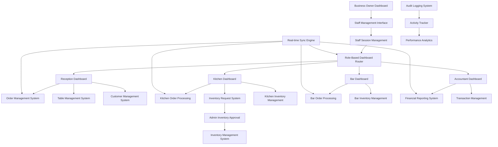

# Design Document

## Overview

The Functional Staff Dashboards system extends the existing staff RBAC infrastructure to provide fully operational role-based dashboards with integrated workflows, real-time synchronization, and comprehensive inventory management. The system transforms static dashboard components into dynamic, interactive interfaces that enable staff to perform their daily operations efficiently while maintaining proper access controls and audit trails.

## Architecture

### High-Level Architecture



### System Components

1. **Enhanced Dashboard Framework**

   - Role-based component rendering
   - Real-time data synchronization
   - Mobile-responsive design
   - Error handling and recovery

2. **Inventory Request Workflow**

   - Kitchen staff request interface
   - Admin approval system
   - Request tracking and notifications
   - Integration with existing inventory

3. **Operational Integration Layer**

   - Cross-dashboard synchronization
   - Event-driven updates
   - Conflict resolution
   - Data consistency management

4. **Enhanced Audit System**
   - Comprehensive action logging
   - Performance tracking
   - Business intelligence integration
   - Compliance reporting

## Components and Interfaces

### Core Dashboard Components

#### 1. Enhanced Reception Dashboard

**ReceptionDashboardOperational**

```typescript
interface ReceptionDashboardProps {
  staffSession: StaffSession;
  realTimeSync: RealTimeSyncManager;
}

// Enhanced Features:
// - Functional order creation with menu integration
// - Real-time table management with drag-drop assignment
// - Customer lookup with history and preferences
// - Payment processing with multiple payment methods
// - Order tracking with status updates
// - Integration with kitchen and bar dashboards
```

**OrderCreationModal**

```typescript
interface OrderCreationModalProps {
  isOpen: boolean;
  onClose: () => void;
  onOrderCreated: (order: Order) => void;
  menuItems: MenuItem[];
  tables: Table[];
  customers: Customer[];
}

// Features:
// - Menu item selection with customization
// - Customer selection or creation
// - Table assignment
// - Special instructions
// - Price calculations with taxes
// - Order confirmation and submission
```

**TableManagementGrid**

```typescript
interface TableManagementGridProps {
  tables: Table[];
  onTableAssign: (tableId: string, customerId: string) => void;
  onTableStatusUpdate: (tableId: string, status: TableStatus) => void;
  realTimeUpdates: boolean;
}

// Features:
// - Visual table layout
// - Drag-drop customer assignment
// - Real-time status updates
// - Table capacity management
// - Reservation handling
```

#### 2. Enhanced Kitchen Dashboard

**KitchenDashboardOperational**

```typescript
interface KitchenDashboardProps {
  staffSession: StaffSession;
  inventoryManager: InventoryRequestManager;
}

// Enhanced Features:
// - Order queue management with priority sorting
// - Item-level status tracking
// - Preparation time estimation
// - Inventory request interface
// - Stock level monitoring
// - Integration with admin approval system
```

**InventoryRequestForm**

```typescript
interface InventoryRequestFormProps {
  availableItems: InventoryItem[];
  onSubmitRequest: (request: InventoryRequest) => void;
  currentStock: StockLevel[];
  requestHistory: InventoryRequest[];
}

// Features:
// - Item selection with search and filtering
// - Quantity specification with justification
// - Urgency level setting
// - Cost estimation
// - Request submission and tracking
// - Integration with admin approval workflow
```

**KitchenOrderProcessor**

```typescript
interface KitchenOrderProcessorProps {
  orders: KitchenOrder[];
  onStatusUpdate: (orderId: string, status: OrderStatus) => void;
  onItemComplete: (orderId: string, itemId: string) => void;
  onAddNotes: (orderId: string, notes: string) => void;
}

// Features:
// - Order prioritization
// - Item-level tracking
// - Preparation notes
// - Time tracking
// - Status notifications
```

#### 3. Enhanced Bar Dashboard

**BarDashboardOperational**

```typescript
interface BarDashboardProps {
  staffSession: StaffSession;
  beverageManager: BeverageManager;
}

// Enhanced Features:
// - Beverage order queue
// - Drink preparation tracking
// - Bar inventory management
// - Recipe management
// - Integration with reception for service coordination
```

#### 4. Enhanced Accountant Dashboard

**AccountantDashboardOperational**

```typescript
interface AccountantDashboardProps {
  staffSession: StaffSession;
  financialManager: FinancialManager;
}

// Enhanced Features:
// - Real-time financial reporting
// - Transaction analysis
// - Refund processing
// - Audit trail viewing
// - Performance analytics
// - Export capabilities
```

### Inventory Management System

#### 1. Admin Inventory Approval System

**InventoryRequestManager**

```typescript
interface InventoryRequestManagerProps {
  businessId: string;
  onRequestApprove: (
    requestId: string,
    modifications: RequestModification[]
  ) => void;
  onRequestDeny: (requestId: string, reason: string) => void;
}

// Features:
// - Request queue management
// - Item modification interface
// - Price adjustment tools
// - Supplier integration
// - Approval workflow
// - Notification system
```

**RequestApprovalInterface**

```typescript
interface RequestApprovalInterfaceProps {
  request: InventoryRequest;
  suppliers: Supplier[];
  currentPrices: PriceData[];
  onModifyRequest: (modifications: RequestModification[]) => void;
  onApprove: () => void;
  onDeny: (reason: string) => void;
}

// Features:
// - Request details display
// - Item quantity modification
// - Price editing with supplier data
// - Approval/denial actions
// - Reason tracking
// - Cost impact analysis
```

#### 2. Enhanced Inventory Pages

**InventoryDashboardFixed**

```typescript
interface InventoryDashboardProps {
  businessId: string;
  userRole: "admin" | "kitchen" | "bar";
}

// Fixed Features:
// - All navigation links functional
// - CRUD operations working
// - Report generation active
// - Export functions operational
// - Real-time stock updates
// - Integration with request system
```

### Data Models

#### Enhanced Inventory Request Model

```typescript
interface InventoryRequest {
  id: string;
  business_id: string;
  requested_by_staff_id: string;
  requested_by_staff: Staff;
  items: InventoryRequestItem[];
  status: "pending" | "approved" | "denied" | "partially_approved";
  urgency_level: "low" | "normal" | "high" | "urgent";
  justification: string;
  total_estimated_cost: number;
  admin_notes?: string;
  approved_by_admin_id?: string;
  approved_at?: string;
  denied_reason?: string;
  created_at: string;
  updated_at: string;
}

interface InventoryRequestItem {
  id: string;
  request_id: string;
  inventory_item_id: string;
  inventory_item: InventoryItem;
  requested_quantity: number;
  approved_quantity?: number;
  estimated_unit_cost: number;
  approved_unit_cost?: number;
  supplier_id?: string;
  supplier?: Supplier;
  notes?: string;
}
```

#### Enhanced Dashboard State Model

```typescript
interface DashboardState {
  staffSession: StaffSession;
  realTimeData: {
    orders: Order[];
    tables: Table[];
    inventory: InventoryItem[];
    requests: InventoryRequest[];
  };
  uiState: {
    activeModals: string[];
    notifications: Notification[];
    errors: ErrorState[];
  };
  syncStatus: {
    lastSync: string;
    isOnline: boolean;
    pendingActions: PendingAction[];
  };
}
```

### Real-Time Synchronization

#### 1. Sync Engine Architecture

**RealTimeSyncManager**

```typescript
class RealTimeSyncManager {
  private supabaseClient: SupabaseClient;
  private eventBus: EventBus;
  private conflictResolver: ConflictResolver;

  // Methods:
  // - subscribeToOrderUpdates()
  // - subscribeToInventoryChanges()
  // - subscribeToTableUpdates()
  // - handleConflicts()
  // - broadcastChanges()
  // - queueOfflineActions()
}
```

#### 2. Event-Driven Updates

**EventBus System**

```typescript
interface DashboardEvent {
  type:
    | "order_updated"
    | "inventory_changed"
    | "table_assigned"
    | "request_approved";
  payload: any;
  timestamp: string;
  source_staff_id: string;
  target_dashboards: string[];
}

// Event Flow:
// 1. Staff action triggers event
// 2. Event bus broadcasts to relevant dashboards
// 3. Dashboards update UI in real-time
// 4. Conflicts resolved automatically
// 5. Audit log updated
```

### Mobile Responsiveness

#### 1. Responsive Design System

**Mobile-First Components**

```typescript
// Breakpoint system
const breakpoints = {
  mobile: "320px",
  tablet: "768px",
  desktop: "1024px",
  wide: "1440px",
};

// Responsive dashboard layouts
interface ResponsiveLayoutProps {
  breakpoint: keyof typeof breakpoints;
  children: React.ReactNode;
  sidebarCollapsed?: boolean;
}
```

#### 2. Touch-Optimized Interfaces

**TouchOptimizedControls**

```typescript
// Touch-friendly button sizes (minimum 44px)
// Swipe gestures for order management
// Pinch-to-zoom for table layouts
// Long-press for context menus
// Haptic feedback for confirmations
```

## Error Handling

### 1. Network Resilience

**OfflineCapabilities**

```typescript
class OfflineManager {
  private localQueue: ActionQueue;
  private syncManager: SyncManager;

  // Features:
  // - Queue actions when offline
  // - Sync when connection restored
  // - Conflict resolution
  // - Data integrity checks
  // - User feedback
}
```

### 2. Error Recovery

**ErrorBoundarySystem**

```typescript
interface ErrorRecoveryProps {
  fallbackComponent: React.ComponentType;
  onError: (error: Error, errorInfo: ErrorInfo) => void;
  retryAction?: () => void;
}

// Error Types:
// - Network errors
// - Permission errors
// - Data validation errors
// - System errors
// - User errors
```

## Testing Strategy

### 1. Component Testing

**Dashboard Component Tests**

- Role-based rendering
- Permission enforcement
- Real-time updates
- Error handling
- Mobile responsiveness

### 2. Integration Testing

**Cross-Dashboard Integration**

- Order flow between reception and kitchen
- Inventory request workflow
- Real-time synchronization
- Data consistency

### 3. End-to-End Testing

**Complete Workflow Tests**

- Order creation to completion
- Inventory request to approval
- Payment processing
- Staff session management

### 4. Performance Testing

**Load and Stress Testing**

- Multiple concurrent staff sessions
- High-frequency real-time updates
- Large inventory datasets
- Mobile device performance

## Security Considerations

### 1. Enhanced Permission System

**Granular Permissions**

```typescript
interface EnhancedPermissions {
  orders: {
    create: boolean;
    read: boolean;
    update: boolean;
    delete: boolean;
    view_all: boolean;
  };
  inventory: {
    view: boolean;
    request: boolean;
    approve: boolean;
    modify: boolean;
  };
  financial: {
    view_transactions: boolean;
    process_refunds: boolean;
    generate_reports: boolean;
  };
}
```

### 2. Audit and Compliance

**Enhanced Audit Logging**

```typescript
interface AuditLog {
  id: string;
  staff_id: string;
  action: string;
  resource_type: string;
  resource_id: string;
  old_values?: any;
  new_values?: any;
  ip_address: string;
  user_agent: string;
  timestamp: string;
  session_id: string;
}
```

**Staff Activity Logging for Performance Tracking**

```typescript
interface StaffActivityLog {
  id: string;
  staff_id: string;
  staff_session_id: string;
  activity_type:
    | "order_created"
    | "order_updated"
    | "payment_processed"
    | "inventory_requested"
    | "table_assigned"
    | "customer_served";
  activity_details: {
    resource_id: string;
    resource_type: string;
    action_duration?: number; // in milliseconds
    success: boolean;
    error_message?: string;
    additional_data?: any;
  };
  performance_metrics: {
    response_time: number;
    efficiency_score?: number;
    customer_satisfaction?: number;
  };
  timestamp: string;
  shift_date: string;
}

// Integration with Staff Management Performance Tab
interface StaffPerformanceMetrics {
  staff_id: string;
  date_range: { start: string; end: string };
  metrics: {
    orders_processed: number;
    average_order_time: number;
    customer_interactions: number;
    inventory_requests: number;
    error_rate: number;
    efficiency_score: number;
    total_revenue_generated: number;
  };
  activity_breakdown: {
    [activity_type: string]: {
      count: number;
      average_duration: number;
      success_rate: number;
    };
  };
}
```

## Implementation Considerations

### 1. Database Integration and Enhancements

**Existing Tables to Leverage**

```sql
-- Use existing tables for core functionality
-- orders (existing) - for reception dashboard order creation
-- order_items (existing) - for kitchen/bar order processing
-- inventory_items (existing) - for stock management
-- inventory_transactions (existing) - for stock updates
-- payments (existing) - for reception payment processing
-- staff (existing) - for staff authentication and permissions
-- staff_sessions (existing) - for session management
-- audit_logs (existing) - for activity tracking
```

**New Tables Required (Only for new functionality)**

```sql
-- Inventory requests table (new functionality)
CREATE TABLE inventory_requests (
  id UUID PRIMARY KEY DEFAULT gen_random_uuid(),
  business_id UUID NOT NULL REFERENCES business_owner(id),
  requested_by_staff_id UUID NOT NULL REFERENCES staff(id),
  status TEXT NOT NULL DEFAULT 'pending',
  urgency_level TEXT NOT NULL DEFAULT 'normal',
  justification TEXT,
  total_estimated_cost DECIMAL(10,2),
  admin_notes TEXT,
  approved_by_admin_id UUID REFERENCES business_owner(id),
  approved_at TIMESTAMP WITH TIME ZONE,
  denied_reason TEXT,
  created_at TIMESTAMP WITH TIME ZONE DEFAULT NOW(),
  updated_at TIMESTAMP WITH TIME ZONE DEFAULT NOW()
);

-- Inventory request items table (new functionality)
CREATE TABLE inventory_request_items (
  id UUID PRIMARY KEY DEFAULT gen_random_uuid(),
  request_id UUID NOT NULL REFERENCES inventory_requests(id),
  inventory_item_id UUID NOT NULL REFERENCES inventory_items(id),
  requested_quantity INTEGER NOT NULL,
  approved_quantity INTEGER,
  estimated_unit_cost DECIMAL(10,2),
  approved_unit_cost DECIMAL(10,2),
  supplier_id UUID REFERENCES suppliers(id),
  notes TEXT,
  created_at TIMESTAMP WITH TIME ZONE DEFAULT NOW()
);

-- Staff activity logs for performance tracking (extends existing audit_logs)
CREATE TABLE staff_activity_logs (
  id UUID PRIMARY KEY DEFAULT gen_random_uuid(),
  staff_id UUID NOT NULL REFERENCES staff(id),
  staff_session_id UUID NOT NULL REFERENCES staff_sessions(id),
  activity_type TEXT NOT NULL,
  activity_details JSONB NOT NULL,
  performance_metrics JSONB,
  timestamp TIMESTAMP WITH TIME ZONE DEFAULT NOW(),
  shift_date DATE NOT NULL,
  created_at TIMESTAMP WITH TIME ZONE DEFAULT NOW()
);
```

### 2. API Integration and Enhancements

**Existing API Integration**

```typescript
// Use existing order APIs
POST /api/orders (existing - integrate with reception dashboard)
GET /api/orders (existing - filter by staff permissions)
PUT /api/orders/:id/status (existing - integrate with kitchen/bar dashboards)
DELETE /api/orders/:id (existing - integrate with reception dashboard)

// Use existing inventory APIs
GET /api/inventory/items (existing - integrate with all dashboards)
PUT /api/inventory/items/:id (existing - integrate with kitchen/bar stock updates)
GET /api/inventory/alerts (existing - integrate with kitchen dashboard)

// Use existing payment APIs
POST /api/payments (existing - integrate with reception dashboard)
GET /api/payments (existing - integrate with accountant dashboard)

// Use existing menu APIs
GET /api/menu/items (existing - integrate with reception order creation)
```

**New API Endpoints (Only for new functionality)**

```typescript
// Inventory request endpoints (new functionality)
POST /api/inventory/requests
GET /api/inventory/requests
PUT /api/inventory/requests/:id/approve
PUT /api/inventory/requests/:id/deny
GET /api/inventory/requests/:id

// Staff activity logging endpoints (for performance tracking)
POST /api/staff/activity/log
GET /api/staff/activity/:staffId
GET /api/staff/performance/:staffId

// Real-time subscription endpoints
WebSocket /api/realtime/dashboard/:staffId
```

### 3. Performance Optimizations

**Caching Strategy**

- Redis for real-time data
- Browser caching for static assets
- Database query optimization
- Lazy loading for large datasets

**Real-time Optimization**

- WebSocket connection pooling
- Event debouncing
- Selective data updates
- Efficient conflict resolution

### 4. Migration Strategy

**Phased Implementation**

1. Phase 1: Fix existing inventory pages
2. Phase 2: Implement inventory request system
3. Phase 3: Enhance reception dashboard
4. Phase 4: Enhance kitchen dashboard
5. Phase 5: Enhance bar and accountant dashboards
6. Phase 6: Implement real-time synchronization
7. Phase 7: Mobile optimization and testing

**Data Migration**

- Preserve existing staff sessions
- Migrate inventory data
- Update permission structures
- Create audit log entries
