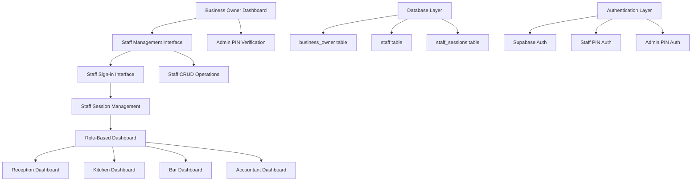

# Design Document

## Overview

The Staff RBAC System is a comprehensive role-based access control solution that enables business owners to manage staff members with specific roles and permissions. The system integrates with the existing Supabase authentication infrastructure and provides a secure, session-based approach to staff management. Business owners can add staff, assign roles (reception, kitchen, bar, accountant), and sign in staff members from their dashboard. The system also includes an admin PIN feature for elevated business owner access to sensitive operations.

## Architecture

### High-Level Architecture



### System Components

1. **Authentication Layer**

   - Existing Supabase Auth for business owners
   - Custom PIN-based authentication for staff
   - Admin PIN verification for elevated access

2. **Session Management**

   - Business owner sessions (existing)
   - Staff sessions with role-based permissions
   - Session tracking and expiration

3. **Role-Based Access Control**

   - Permission-based UI rendering
   - API endpoint protection
   - Role-specific dashboard views

4. **Database Layer**
   - Enhanced staff table with role constraints
   - New staff_sessions table for session tracking
   - Admin PIN storage in business_owner table

## Components and Interfaces

### Core Components

#### 1. Staff Management Components

**StaffManagementInterface**

```typescript
interface StaffManagementProps {
  businessId: string;
  currentUser: BusinessOwner;
}

// Features:
// - Add new staff members
// - View staff list with roles and status
// - Edit staff information and permissions
// - Reset staff PINs
// - Activate/deactivate staff accounts
```

**StaffSignInInterface**

```typescript
interface StaffSignInProps {
  businessId: string;
  activeStaffSessions: StaffSession[];
  onStaffSignIn: (staffId: string, pin: string) => Promise<void>;
  onStaffSignOut: (sessionId: string) => Promise<void>;
}

// Features:
// - Display available staff for sign-in
// - PIN input for staff authentication
// - Show currently signed-in staff
// - Bulk sign-out functionality
```

#### 2. Admin PIN Components

**AdminPINVerification**

```typescript
interface AdminPINProps {
  onVerificationSuccess: () => void;
  onVerificationFailed: (error: string) => void;
  requiredFor: "staff_management" | "financial_operations" | "system_settings";
}

// Features:
// - PIN input with masking
// - Verification against hashed admin PIN
// - Temporary elevated session management
// - Lockout after failed attempts
```

#### 3. Role-Based Dashboard Components

**RoleBasedDashboard**

```typescript
interface RoleDashboardProps {
  staffSession: StaffSession;
  permissions: string[];
}

// Renders different dashboard based on staff role:
// - ReceptionDashboard
// - KitchenDashboard
// - BarDashboard
// - AccountantDashboard
```

### Data Models

#### Enhanced Staff Model

```typescript
interface Staff {
  id: string;
  business_id: string;
  first_name: string;
  last_name: string;
  email?: string;
  phone_number?: string;
  pin_hash: string;
  role: "reception" | "kitchen" | "bar" | "accountant";
  permissions: string[];
  is_active: boolean;
  created_at: string;
  updated_at: string;
  last_login_at?: string;
}
```

#### Staff Session Model

```typescript
interface StaffSession {
  id: string;
  staff_id: string;
  business_id: string;
  session_token: string;
  signed_in_by: string; // business owner ID
  signed_in_at: string;
  signed_out_at?: string;
  is_active: boolean;
  expires_at: string;
}
```

#### Business Owner Enhancement

```typescript
interface BusinessOwner {
  // ... existing fields
  admin_pin_hash?: string; // New field for elevated access
}
```

### Permission System

#### Role-Based Permissions

**Reception Role Permissions:**

- `orders:create` - Create new orders
- `orders:read` - View order details
- `orders:update` - Update order status
- `tables:read` - View table status
- `tables:update` - Assign/update tables
- `customers:read` - Access customer information
- `payments:process` - Process payments

**Kitchen Role Permissions:**

- `orders:read` - View kitchen orders
- `orders:update_status` - Update preparation status
- `inventory:read` - View kitchen inventory
- `inventory:update` - Update stock levels
- `inventory:alerts` - Create low stock alerts

**Bar Role Permissions:**

- `orders:read` - View beverage orders
- `orders:update_status` - Update drink preparation status
- `inventory:read` - View bar inventory
- `inventory:update` - Update beverage stock
- `inventory:restock_requests` - Create restock requests

**Accountant Role Permissions:**

- `reports:read` - View financial reports
- `transactions:read` - Access transaction history
- `payments:read` - View payment details
- `reports:generate` - Generate financial reports
- `payments:refund` - Process refunds

## Error Handling

### Authentication Errors

1. **Invalid Staff PIN**

   - Rate limiting after 3 failed attempts
   - 15-minute lockout period
   - Clear error messaging

2. **Session Expiration**

   - Automatic sign-out after 8 hours
   - Grace period with session extension option
   - Redirect to appropriate sign-in interface

3. **Admin PIN Failures**
   - Temporary lockout after 5 failed attempts
   - 30-minute lockout for admin access
   - Audit logging of failed attempts

### Database Errors

1. **Staff Creation Failures**

   - Duplicate email/phone validation
   - Role constraint violations
   - Graceful error handling with user feedback

2. **Session Management Errors**
   - Orphaned session cleanup
   - Concurrent session handling
   - Database connection failures

### Permission Errors

1. **Unauthorized Access**

   - Clear permission denied messages
   - Redirect to appropriate dashboard
   - Audit logging of unauthorized attempts

2. **Role Mismatch**
   - Dynamic permission checking
   - UI element hiding for unauthorized actions
   - API endpoint protection

## Testing Strategy

### Unit Testing

1. **Authentication Functions**

   - PIN hashing and verification
   - Session token generation
   - Permission validation logic

2. **Role-Based Components**
   - Permission-based rendering
   - Role-specific functionality
   - Error state handling

### Integration Testing

1. **Staff Management Flow**

   - End-to-end staff creation
   - Sign-in/sign-out processes
   - Permission enforcement

2. **Database Operations**
   - Staff CRUD operations
   - Session management
   - Data consistency checks

### Security Testing

1. **Authentication Security**

   - PIN brute force protection
   - Session hijacking prevention
   - Admin PIN security

2. **Authorization Testing**
   - Role-based access control
   - Permission boundary testing
   - Privilege escalation prevention

### User Acceptance Testing

1. **Business Owner Workflows**

   - Staff management operations
   - Admin PIN usage
   - Session monitoring

2. **Staff Workflows**
   - Role-specific dashboard usage
   - Permission-based functionality
   - Session handling

## Implementation Considerations

### Security Measures

1. **PIN Security**

   - Bcrypt hashing with salt rounds 12
   - Rate limiting on authentication attempts
   - Secure PIN generation and distribution

2. **Session Security**

   - Cryptographically secure session tokens
   - Session expiration and cleanup
   - CSRF protection for state-changing operations

3. **Admin Access**
   - Separate admin PIN for elevated operations
   - Time-limited elevated sessions
   - Audit logging for admin actions

### Performance Optimizations

1. **Database Indexing**

   - Indexes on frequently queried fields
   - Composite indexes for role-based queries
   - Session cleanup background jobs

2. **Caching Strategy**
   - Permission caching for active sessions
   - Staff data caching with invalidation
   - Role-based UI component caching

### Scalability Considerations

1. **Session Management**

   - Horizontal scaling of session storage
   - Load balancing for concurrent sessions
   - Session cleanup and maintenance

2. **Permission System**
   - Efficient permission checking algorithms
   - Role hierarchy for complex permissions
   - Dynamic permission updates

### Migration Strategy

1. **Database Migration**

   - Add admin_pin_hash to business_owner table
   - Create staff_sessions table with proper constraints
   - Update staff table with role constraints

2. **Code Migration**

   - Update existing staff types and interfaces
   - Implement new authentication middleware
   - Add role-based routing and components

3. **Data Migration**
   - Update existing staff roles to new format
   - Generate admin PINs for existing business owners
   - Clean up any inconsistent staff data
